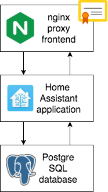

[](https://opensource.org/licenses/MIT)

A simple way to try Home Assistant on the Docker platform, or to migrate your existing Home Assistant configuration onto new servers using Docker Compose.

## Get started with HA on Docker



Here is a basic setup that anyone can use to 
get started with Home Assistant in Docker Containers. 
This is not the final configuration, but a jump-off point 
if you want to make the leap to Docker. 
I came from a python venv setup and, 
once I'd ironed out the issues by using these config files, 
I was surprised at how quick and simple it was to do things with Docker. 

This is a really simple Docker compose stack. 
These configs give you a vanilla install, 
but using three separate containers for the classic split 
of web front-end, application layer and database back-end.
From here you can add your own configuration yaml files on top,
and it works really well as a starting point for a git repository, 
allowing you to come back and rebuild this deployment from scratch very quickly.


## Quick start with docker

All you need to get going with this is:

* [a basic operating system](/about/setting-up-your-system.md) (like Ubuntu Server)
* [the Docker Engine](/about/installing-docker.md)

If you don't already have these, click on those links above for step-by-step instructions on each.

Then prepare a couple of folders:

```
ROOTDIR=/srv/docker

sudo mkdir -p $ROOTDIR/
# if issues consider 
# sudo chmod 777 -R $ROOTDIR/
sudo chown $USER:$USER -R $ROOTDIR/
mkdir -p $ROOTDIR/data/
mkdir -p $ROOTDIR/data/secrets
mkdir -p $ROOTDIR/config/
```


Then simply clone this repo. Note the dot at the end of the git command that clones into the current folder.

```
cd $ROOTDIR/config/
git clone https://github.com/artmg/home-assistant-docker.git .
```

You will need to provide:

* [secrets](/hass/README.md)
* [environment variables](/compose/README.md)

Then simply run the docker compose

```
cd $ROOTDIR/config/docker/compose
docker-compose up -d
```

Providing your server can see the internet it will 
pull down all the docker images, set up the virtual networks, 
create the volumes and containers, and start them running. 

All you need do now is to point your browser to  `http://servername`
and you should see the Home Assistant start page appear.

Welcome to the world of Home Assistant running on Docker.


## Why use this?

Many people start off on a hobbyist device like a Raspberry Pi 
and then realise that they want more reliability or power. 
When moving to a 'NUC' mini-pc, or an old PC they have available 
they realise that their device can cope with more services 
and Docker is a common deployment method that allows diversity 
in a single physical box. 

This repo is intended as a stepping stone, to help users 
new to Docker to migrate their configurations into a working 
environment as easily as possible. 

### What else can I do?

If you want to try this out, simply clone the repo to your device. 

If you want to use it to transform your config onto a Docker platform, then fork it to your own repo and begin adding your own code. 

Note that forked repos are public by default. You should consider either making your fork private, or at least being careful with the details of your own environment that you make public.

### But why should I use Docker?

You will find plenty of people who say how great it is to run HA on Docker because of X, Y or Z.

For me, however, the most simple and powerful reason is because I can reinstall my server from bare-metal to a fully working config in a very short period of time (most of which I can be watching a movie in the background)

Because I store my configuration in a version-controlled git repo, I know it is going to work just like before. This gives an incredible flexibility to move, upgrade, test, tinker... I am no longer bound up inside the box that I spent all that time making things work in.

* **Freedom - Flexibility - Resilience**


## Documentation To Do

Yes, it's still a Work in Progress :)

* If you started with a clone, and already added your own config, how to turn the modified clone into your own repo - https://github.com/artmg/lubuild/blob/master/help/use/git-source-control.md#workflow-examples
* Data Notes (linked from compose/README)


## How to contribute

This project welcomes:

* Pull Requests (PRs), but please remember this is supposed to be a shell configuration as a starting point for other user's own configuration.
* suggestions of how to separate the shell from other individual / personalised configuration elements
* Test Scripts - ideas for how to validate that this basic shell comes up as expected
* ideas for what optional basic containers to include, and the simplest way (for users) to integrate them

